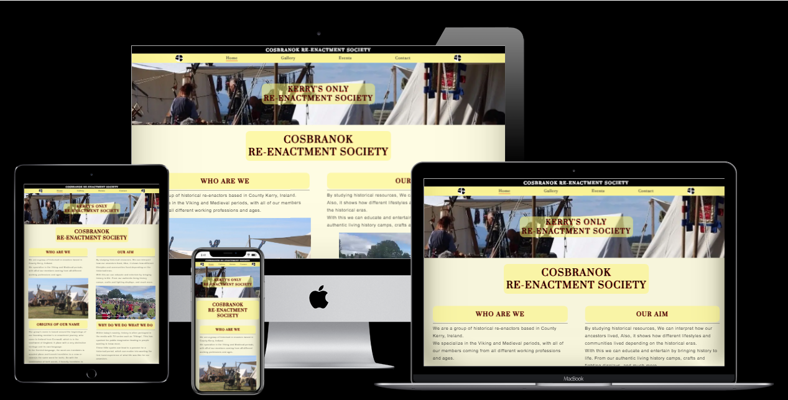
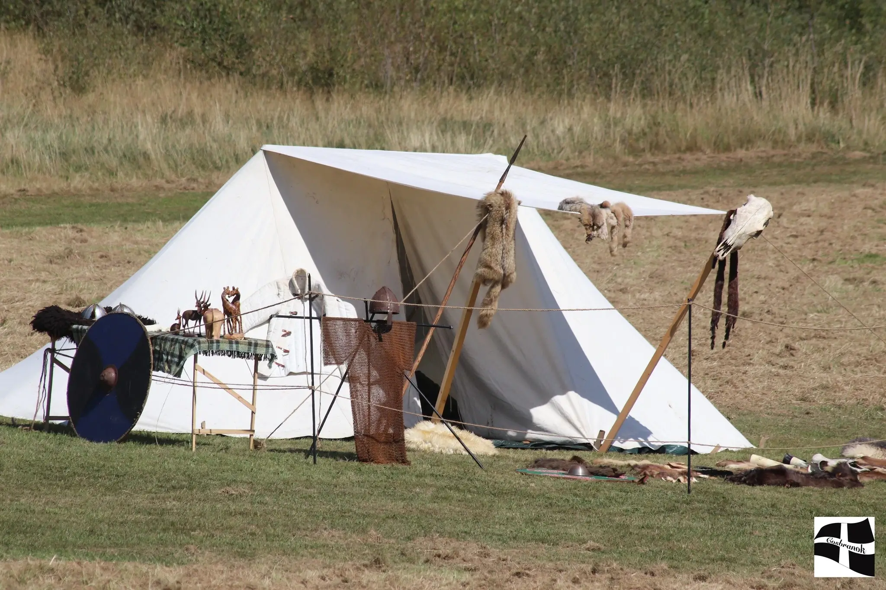
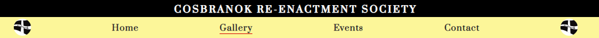
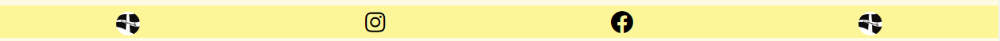
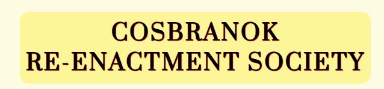

# _Cosbranok Re-enactment Society_

This is a featured website publication to represent the Cosbranok Re-enactment Society in Co.Kerry, Ireland. 

This website is to provide information about Cosbranok and what they do as a re-enactment society using a mixture of written content and pictures. 

It also displays dates and times of shows they attend throughout the year to allow people to be able to them firsthand.

Finally With a contact form which allows the people to enquire about more in-depth information, or for the purpose to enquire about becoming a member of Cosbranok.

[__Click here to view published site__](https://a-croshaw.github.io/cosbranok/)

# _Website Features_

# _Continuous Elements_

These features are across all of the pages, giving a basic structure which gives the user a more pleasent experience and they are able to easly navigate throught out the website.

## _1 - The background_

The background for index.html and the gallery.html is a slightly yellow-creamy color `#f5e5001c` this is so the focus can be on the content and for the user to be able to read the content or look at the images with ease

There is an image for the background for the events.html and contact.html 

The image is used on these to pages because there are larger gaps between the content, so with the picture it takes away  these areas of block colour and give the user an more exciteble experince.

## _2 - The Navigation Bar_

    * There is a header that has a black background and white text. 
    * the navigation bar is placed at the top of the site pages. 
    * The navigation bar remains in the same place across all screen sizes.
    * There is a logo placed on the left and right ends of the navigation bar.
    * there is a hover over feature that changes the text colour to red over 4 seconds. 
    * Finally, there is a red line that indicate the current page the user is veiwing.

The backgound colour is (`#fcf377ad`) to keep in line with the suttle colours that are through out.

## _3 - The Footer_

    * The footer consists of two socail media links ont to facebook and the other to instagram.
    * A logo on the left and right ends.

The backgound colour (`#fcf377ad`) is the same as the header to keep in line with the suttle colours that are throughout.

## _4 - The Headers_

## _5 - Favicon_

# _The Landing Page_

## _The Top Image_

## _The Main Content_

# _The Gallery Page_

# _The Events Page_

# _The Contact Page_

## _Enquiry For_

## _Social Media Links_

# _Thank You Page_

# _404 Page_

#fcf377ad;
#fcf37788
#fcf377ce
