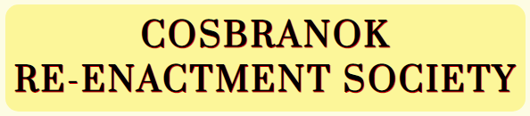
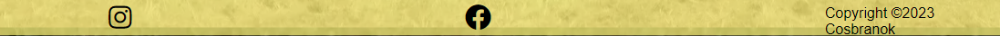
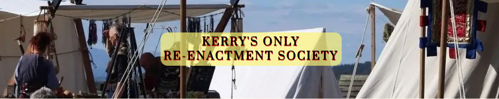
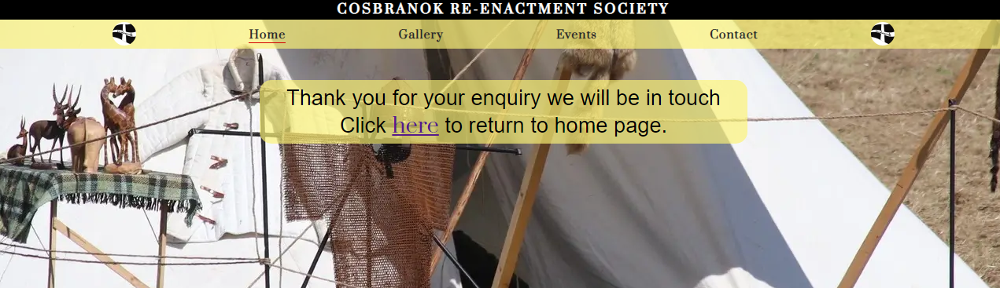

# _Cosbranok Re-enactment Society_

This is a featured website publication to represent the Cosbranok Re-enactment Society in Co.Kerry, Ireland. 

This website is to provide information about Cosbranok and what they do as a re-enactment society using a mixture of written content and pictures. 

It also displays dates and times of shows they attend throughout the year to allow people to be able to them firsthand.

Finally With a contact form which allows the people to enquire about more in-depth information, or for the purpose to enquire about becoming a member of Cosbranok.

[__Click here to view published site__](https://a-croshaw.github.io/cosbranok/)

# _Features_

## _Elements on all pages_

These features are across all of the pages, giving a basic structure which gives the user a more pleasent experience and they are able to easly navigate throught out the website.

### _1 - The background_

* The background for index.html and the gallery.html is a slightly yellow-creamy color `#f5e5001c` this is so the focus can be on the content and allows the user to be able to read the content or look at the images with ease.

* There is an image for the background for the events.html and contact.html 

* The image is used on these to pages because there are larger gaps between the content, so with the picture it takes away  these areas of block colour and give the user an more exciteble experince.

### _2 - Page Header and Navigation Bar_

* There is a header that has a black background and white text above the navigation bar. 

* the navigation bar is placed at the top of the site pages. 

* The navigation bar remains in the same place across all screen sizes.

* On the left and right at both ends of the navigation bar is the cosbranok Logo.

* there is a hover over feature that changes the text colour to red over 4 seconds. 

* Finally, there is a red line that indicate the current page the user is veiwing.

* The backgound colour is (`#fcf377ad`) to keep in line with the suttle colours that are through out.

### _3 - The Headers_

* For the headers on all pages the fonts are the same with the same background color as the navigation bar and the footer, also the box holding the headers has rounded corners to give a smoother finish.

* The font used is Prata, used from google fonts.

* This font is used to look like old-style writing but to maintain readability for the viewers of the site.

### _4 - The Footer_

* The footer consists of two socail media links ont to facebook and the other to instagram.

* On the left and right at both ends of the footer is the cosbranok Logo.

* The backgound colour (`#fcf377ad`) is the same as the header to keep in line with the suttle colours that are throughout.

### _5 - Favicon_

* The favicon icon indcates to the user what is within a certain tab on there browser when they have several tabs open.

* the favicon icon used is the cosbranok logo.

## _The Landing Page_

### _Landing Page Image_

* When the page first loads, the user sees a narrow photograph of living history tents.

* With animation to give an effect that the user is moving closer, this is done but moving the picture forward over a 5 seconds.

* There is a statement withing the center of the image, That is believed to be true by the founders of cosbranok after there research of current re-enactment societys with in Ireland.

* This statement is in the same style as the main headers, with the same colored background, rounded corners, and the same font style.

### _The Main Content_

* Within the main content you have four headed sections, a photograph and a video.

* The Four sections give details about the origins of the society, who they are and why they do what they do.

* Each of the four sections has its own header in the same style as the main headers, with the same coloured background, rounded box corners and the same font style.

* The photograph used within the main content is the full view of the narrow animated image at the top of the page.

* The video show a few people reenacting what fighting would of been like with fully functional controls.

* When viewing the site ona smaller scrren size the right content will move below the left content to become a single coloum allowing each section to fill the sceen to be more readible and user friendly.

## _The Gallery Page_

* The gallery page has a header and a four coloum structure.

* The pictues allow the user to visually see what events are typically like.

* When the gallery is viewed on a tablet size screen the gallery displays in a two coloum format.

* When the gallery is view on a small screen like a mobile phone it will display in a single coloum format.

  

## _The Events Page_

 

  

### _Upcoming Events_

### _Past Events_

## _The Contact Page_

### _Enquiry For_

### _Social Media Links_

## _Thank You Page_

## _404 Page_

