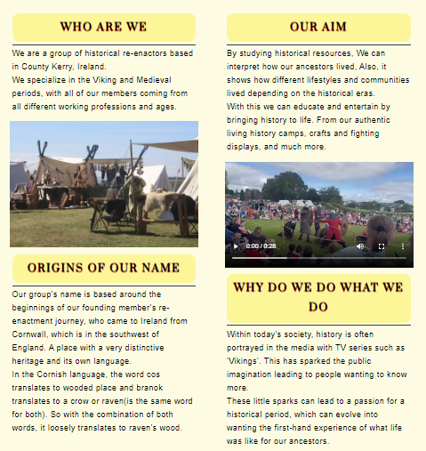
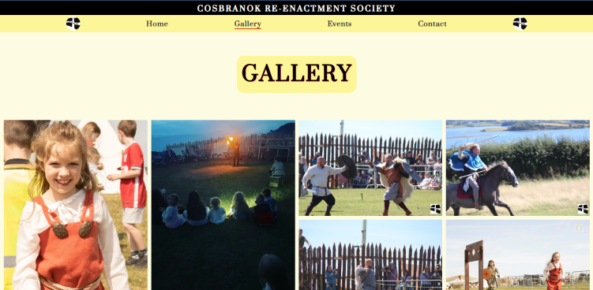
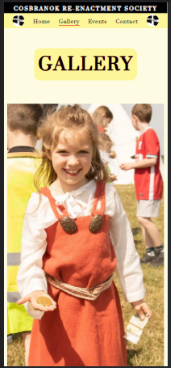
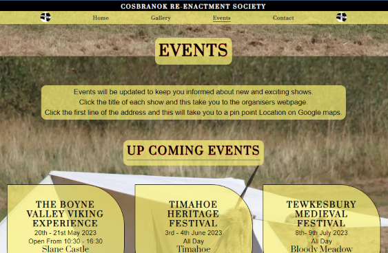

# _Cosbranok Re-enactment Society_

This is a featured website publication to represent the Cosbranok Re-enactment Society in Co.Kerry, Ireland. 

This website is to provide information about Cosbranok and what they do as a re-enactment society using a mixture of written content and pictures. 

It also displays dates and times of shows they attend throughout the year to allow people to be able to them firsthand.

Finally With a contact form which allows the people to enquire about more in-depth information, or for the purpose to enquire about becoming a member of Cosbranok.

[__Click here to view published site__](https://a-croshaw.github.io/cosbranok/)

# _Features_

## _Elements on all pages_

These features are across all of the pages, giving a basic structure that gives the user a more pleasant experience and they are able to easly navigate throught out the website.

### _1 - The background_

 * The background for index.html and the gallery.html is a slightly yellow-creamy color `#f5e5001c` this is so the focus can be on the content and allows the user to be able to read the content or look at the images with ease.

 * There is an image for the background for the events.html and contact.html 

 * The image is used on these to pages because there are larger gaps between the content, so with the picture it takes away  these areas of block colour and give the user an more exciteble experince.

### _2 - Page Header and Navigation Bar_

 * There is a header that has a black background and white text above the navigation bar. 

 * The navigation bar is placed at the top of the site pages. 

 * The navigation bar remains in the same place across all screen sizes.

 * On the left and right at both ends of the navigation bar is the cosbranok Logo.

 * There is a hover-over feature that changes the text colour to red over 4 seconds. 

 * Finally, there is a red line that indicates the current page the user is viewing.

 * The background colour is (`#fcf377ad`) to keep in line with the subtle colours that are through out.

### _3 - The Headers_

 * For the headers on all pages the fonts are the same with the same background color as the navigation bar and the footer, also the box holding the headers has rounded corners to give a smoother finish.

 * The font used is Prata, used from google fonts.

 * This font is used to look like old-style writing but to maintain readability for the viewers of the site.

### _4 - The Footer_

 * The footer consists of two social media links one to facebook and the other to instagram.

 * There is also the copyright on the right-hand side ot the footer.

 * The backgound colour (`#fcf377ad`) is the same as the header to keep in line with the suttle colours that are throughout.
 
 * This allows the user to go over to the social media pages for more information from anywhere on the website.

### _5 - Favicon_

 * The favicon icon indicates to the user what the tab is when they have several tabs open.

 * The favicon icon used is the cosbranok logo.

## _The Landing Page_

### _Landing Page Image_

 * When the page first loads, the user sees a narrow photograph of living history tents.

 * With animation to give an effect that the user is moving closer, this is done but moving the picture forward over a 5 seconds.

 * There is a statement withing the center of the image, That is believed to be true by the founders of cosbranok after there research of current re-enactment societys with in Ireland.

 * This statement is in the same style as the main headers, with the same colored background, rounded corners, and the same font style.

### _The Main Content_

 * Within the main content you have four headed sections, a photograph and a video.

 * The Four sections give details about the origins of the society, who they are and why they do what they do.

 * Each of the four sections has its own header in the same style as the main headers, with the same coloured background, rounded box corners and the same font style.

 * The photograph used within the main content is the full view of the narrow animated image at the top of the page.

 * The video show a few people reenacting what fighting would of been like with fully functional controls.

 * When viewing the site ona smaller scrren size the right content will move below the left content to become a single coloum allowing each section to fill the sceen to be more readible and user friendly.

## _The Gallery Page_

 * Th gallery is a four-column structure.

 * The pictures within the gallery allow the user to visually see what events are typically like.

 * When the gallery is viewed on a tablet size screen the gallery displays in a two-column format.

 * When the gallery is viewed on a small screen like a mobile phone it will display in a single-column format.

  

## _The Events Page_

 * This page gives the user details about upcoming and past events with links to external pages opening on new tabs.

 * The likes will take the user to the organizer of the event's webpage.

 * Within the address there is a link to a google map pinpoint location allowing the user to easily locate the event for directions or journey planning.

 * The boxes are styled with the same background colour (`#fcf377ad`) and have three rounded corners.

 * When this page is viewed on a desktop the events will appear 3 across the screen.

 

 * When this page is viewed on a tablet the events will appear 2 across the screen.

 * When this page is viewed on a mobile the events will appear 1 across the screen.

  

### _Upcoming Events_

 * These are to show the user the upcoming events.

 * The upcoming event displays, 
    * The name of the event with the external link.
    * The Date and times of the event.
    * The address of the event, with the external link in the first line.

### _Past Events_

* These are to show the user the past events that they have attended.

 * The upcoming event displays, 
    * The name of the event with the external link.
    * The Date of when the event was.

## _The Contact Page_

 * This page allows users to contact Cosbranok about enquiries.
 
 * The user can enquire about events or any other queries they may have, by filling out the enqiries form.

 * There are links to the cosbranok's social media accounts so the user can head over to them to make enquiries and find upto date information.

### _Enquiry Form_ 

### _Social Media Links_

## _Thank You Page_

 * This thank you page will be reached when sending enquiries.

 * This will allow the user to know that their enquiry has been sent.

 * It consists of the top header and navigation bar with logos so the user can navigate back to the website more easily.

 * Also there is a link in the word here within the text that will take the user back to the home page.

 * This is all so the user does not have to use the back button on the browser or type the URL to return to the site.

## _404 Page_

 * This 404 page will be reached when a bad link or a miss-typed web address is loaded by the user.

 * It consists of the top header and navigation bar with logos so the user can navigate back to the website more easily.

 * Also there is a link in the word here within the text that will take the user back to the home page.

 * This is all so the user does not have to use the back button on the browser or type the URL to return to the site.

## _Implemented Features_
 
 * The reposiveness of the site 280px and up.

 * All external links open up as they should on all devices.

 * Playable video with complete use of controls.
 
 * Enquiries form that opens a thank you page when submitted.
 
 * Thank you page has a navigation bar and also a link in content to return to the main content of the site.
 
 * 404 page to let the user know there is a broken link or a mistype in the URL.
 
 * 404 page has a navigation bar and also a link in content to return to the main content of the site.

## _Features to be Implemented_

 * Add a transcript to the video on index.html.

 * A separate page dedicated to the purpose of users becoming a member of the Cosbranok re-enactment Society.

 * A separate page dedicated to the purpose of traders for events. 

 * An educational section within the site.

# _Design_
 
 The idea was to have a light and soft finish tho the site hence the use of the soft yellow and cream colours.

## _Index Page_

 * Index page is set up to block the text so it did not have so much writen content in one area at one time even when it gets pushed down to one column for mobile screens. 
 
 * With a narrow hero image at the top of the screen to catch the users eye.

 * With an image and a video giving it more visual aspects to the page.

 

## _Gallery Page_
 
 * The Gallery page will have a header. 
 
 * Followed by four columns of pictures.
 
 * At a medium size screen the screen will show a two column design.
 
 * At mobile screen size the screen will show a single column design.
 
 

## _Events Page_

 * The events and past events sections on the page will have three column design.
 
 * At a medium size screen the screen will show a two column design.
 
 * At mobile screen size the screen will show a single column design.

 * Headers breaking up the upcoming events and past events

 * External links to event websites and loctions shown on google maps.

 

 ## _Contact Page_

 * Will have a contact form for point of contact.

 * Social media links.

 * Simple page layout with minimal content.

 
 

# _Bugs and Testing_

## _Bugs_

 * There are no known bugs within the site after testing on multiple devises.

## _Testing_

### _Responsiveness_

 * The site has been tested on Edge, Safari, Chrome, Firefox, and Opera.

 * Devices the site has been tested range from Samsung 22 + 10 lite, Iphone 11 + 13, PC, and Lenovo tablet.

 * All links worked correctly across all devices.

 * The site is fully responsive across all devices with the screens vertically and horizontal.

 * There are no horizontal scrolls when tested across these devices.

 * The images do not become pixelated.
 
 * None of the content overlaps when screen size reduces.

 * The responsiveness of the site is from 280px (only by testing in chrome developer at this size).

### _Accessibility_

 * All page had their accessibilty check using [Wave](https://wave.webaim.org/)

 * Index.html has one alert for the missing audio transcript.

 * All other pages and areas passed the accessibility tests.
    * All links have proper aria lables.
    * All images have proper alt tags and none are the same.
    * There is no conflicts with the constrast of colours.

         

### _Validation_

* The HTML on all pages passed through the [W3C validator](https://validator.w3.org/) without any errors.

      

   

   

* The CSS code passed through the [Jigsaw validator](https://jigsaw.w3.org/css-validator/) without any errors.

### _Lighthouse Reports_

#### _Desktop_

 * index.html

 * gallery.html

 * events.html

 * contact.html

#### _Mobile_

 * gallery.html

 * events.html

 * contact.html

# _Deployment_

## _Version Control_

 * From the Gitpod  terminal using "git add ." allows the changes wait to be commited.

 * The the "git commit -m "" " with a comment will commit the changes.

 * Then using the "git push" command it will push the commited change to Github.

## _Page Deploymen_

 * Load up the GitHub website and log it to your account
 
 * Select and open the repository to be publish.

 * Click on the settings within this repository and scroll down and open the pages section.

 * Under the build and deployment section within pages put the source to display a branch, select the branch to main and the folder to root and hit the save button.

 * Then select the visit site button at the top to view the live deployment of the site.

 Visit the live deployment of the site [HERE](https://a-croshaw.github.io/cosbranok/).

## _Cloning Repository_

 * To clone the repository for download or use within your GitHub head-over to this link https://github.com/git-guides/git-clone

# _Credits_

## _Content and Media_

 * All written content for this site has been provided but the [Cosbranok](https://www.facebook.com/Cosbranok) founding members. (Tina Croshaw + Kimberley Croshaw)

 * All the images have also been provided by the [Cosbranok](https://www.facebook.com/Cosbranok) founding members (Tina Croshaw + Kimberley Croshaw)

## _Code_

 * For the font syles Prata and Slabo are from [Google-Fonts](https://fonts.google.com/).
 
 * The Favicon code and image icon rendering was produced using [favicon.io](https://favicon.io/).

 * The social media icons used are provided by [Font Awesome](https://fontawesome.com/).
 
 * The use of the [Love-Running](https://github.com/A-Croshaw/love-running) project for refrences to the hero image and form.

 * For the understanding and coding of flexbox [W3Schools](https://www.w3schools.com/css/css3_flexbox.asp) was used.

 * The gallery was based around this example from [W3Schools](https://www.w3schools.com/css/tryit.asp?filename=trycss3_flexbox_image_gallery).

 * For the understanding and css code for aligning flexbox [flexboxfroggy](https://flexboxfroggy.com/) was used.

 * To create the screen mockup i used [techsini.com](https://techsini.com/multi-mockup/index.php).
